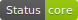
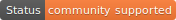
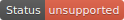

# Large Lakes Statistical Water Balance Model (L2SWBM)

## Description
Meta-repository for the Large Lakes Statistical Water Balance Model (L2SWBM). The L2SWBM used multiple independent data sets to obtain the prior distributions and likelihood functions, which were then assimilated by a Bayesian framework to infer a feasible range of each water balance component. 

## What is L2SWBM?
Water balance models are often employed to improve understanding of drivers of change in regional hydrologic cycles. Most of these models, however, are physically-based, and few employ state-of-the-art statistical methods to reconcile measurement uncertainty and bias.

Starting in 2015, NOAA Great Lakes Environmental Research Laboratory (GLERL), along with its partners at the University of Michigan Cooperative Institute for Great Lakes Research (CIGLR), began developing a water balance model under a Bayesian Markov chain Monte Carlo framework. Through this model, we generate new estimates of monthly runoff, over-lake evaporation, over-lake precipitation, and connecting channel flows for each of the Great Lakes. The new model reconciles discrepancies between model and measurement-based estimates of each component while closing the Laurentian Great Lakes water balance.

In 2017, funding from the International Joint Commission - through their International Watersheds Initiative was received to use the model in generating a new, balanced historical (1950 - 2015) record of the Laurentian Great Lakes water balance. The project will help in resolving the regional water budget across monthly and inter-annual time scales and represents an important stepping stone towards addressing a long-standing need in the Great Lakes for clear and defensible differentiation between hydrological, climatological, geological, and anthropogenic drivers behind seasonal and long-term changes in Laurentian Great Lakes water levels.

To run these models, you will need to do the following:

Visit the JAGS Sourceforge repository and download JAGS for your computer: https://sourceforge.net/projects/mcmc-jags/files/JAGS/

Download the R statistical programming environment https://cran.r-project.org/

Open R, and enter the command "install.packages(c('rjags'))", select your mirror, and install locally if necessary

## What is this repository
The L2SWBM modelling system encompasses many ancillary tools, and we are continually in the
process of making these tools available for general community use. This repository serves as a hub
for all of our publically available tools so that they can be more easily discovered. Furthermore,
these tools are in varying stages of support and this page indicates the current support level for
each tool set.

|Tag|Description|
|------|------|
|  | Fully supported core component of the L2SWBM modelling system |
 | Toolset that is used by the community and maintained by community contributions | 
 | Unsupported new toolset that is in the process of being generalized |

## Official repositories
|Repository|Description|Support status|
|------|------|-----------|
[wrf_hydro_nwm_public](https://github.com/NCAR/wrf_hydro_nwm_public) | Community repository for the core L2SWBM model code |  |
[wrf_hydro_docker](https://github.com/NCAR/wrf_hydro_docker) | Docker files to support the L2SWBM modelling system |  |
[wrf_hydro_training](https://github.com/NCAR/wrf_hydro_training) | Materials from L2SWBM training workshops |  |
[Estimates of the water balance of the Laurentian Great Lakes using L2SWBM](https://deepblue.lib.umich.edu/data/collections/5425k9888?locale=en) | University of Michigan's Deep Blue archive |  |
[Monthly water balance estimates for the Laurentian Great Lakes from 1950 to 2019 using L2SWBM](https://deepblue.lib.umich.edu/data/concern/data_sets/sb3978457) | University of Michigan's Deep Blue archive |  |
[rwrfhydro](https://github.com/NCAR/rwrfhydro) | A toolbox for L2SWBM input and output files in R |  |

